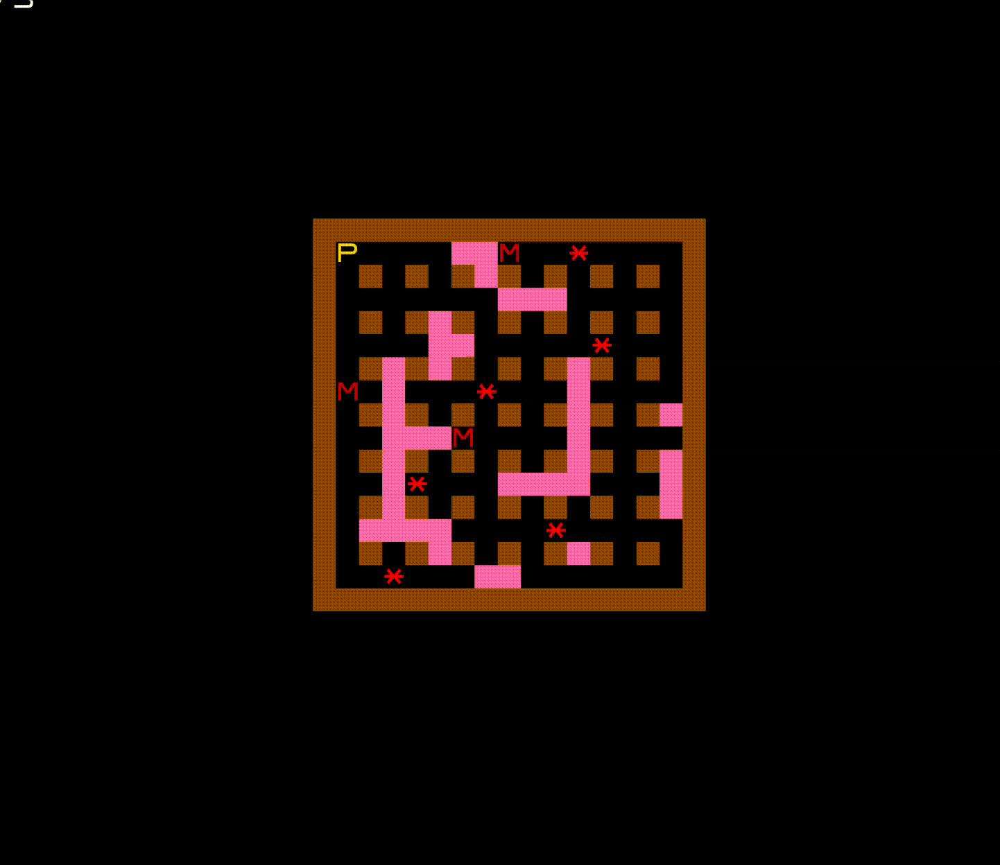
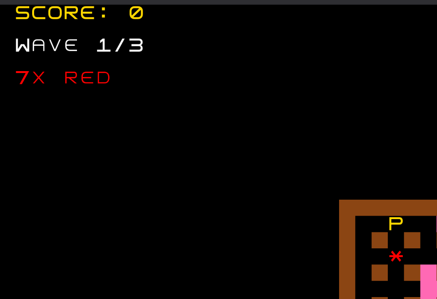
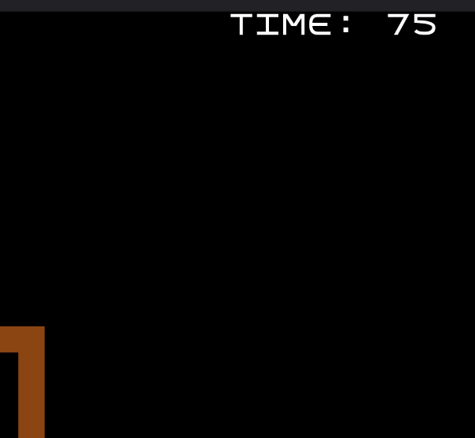
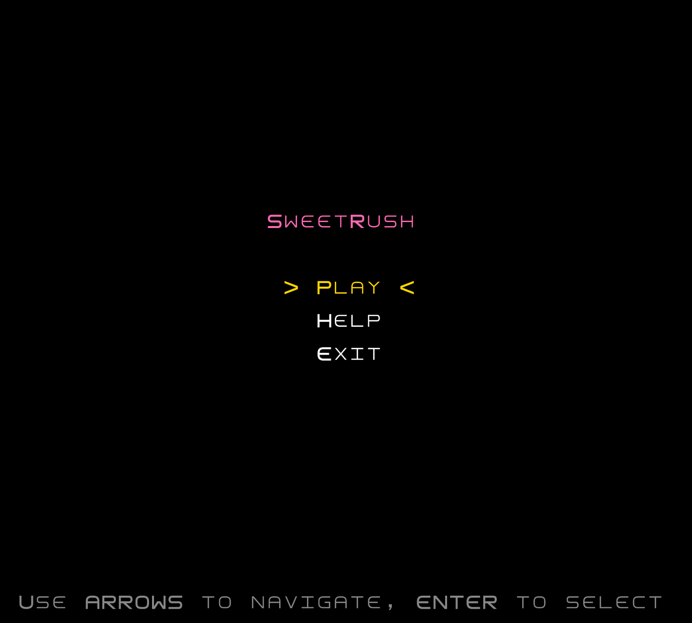
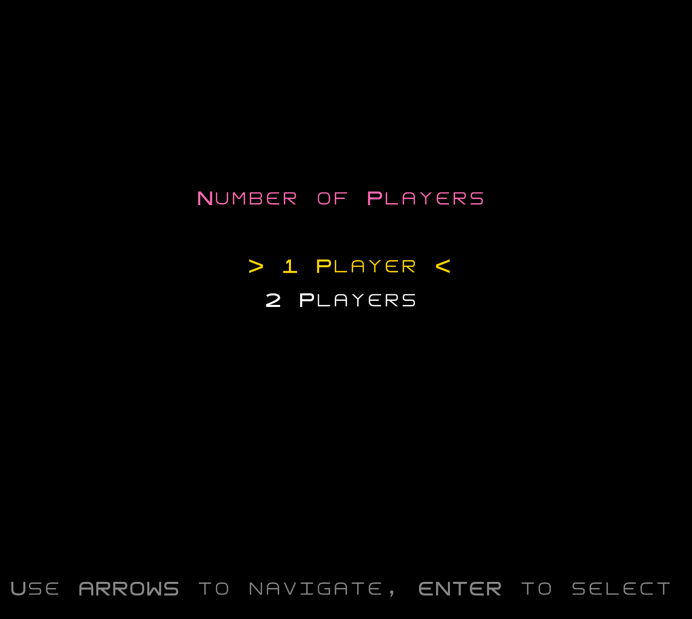
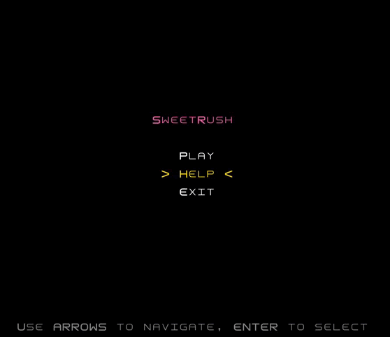
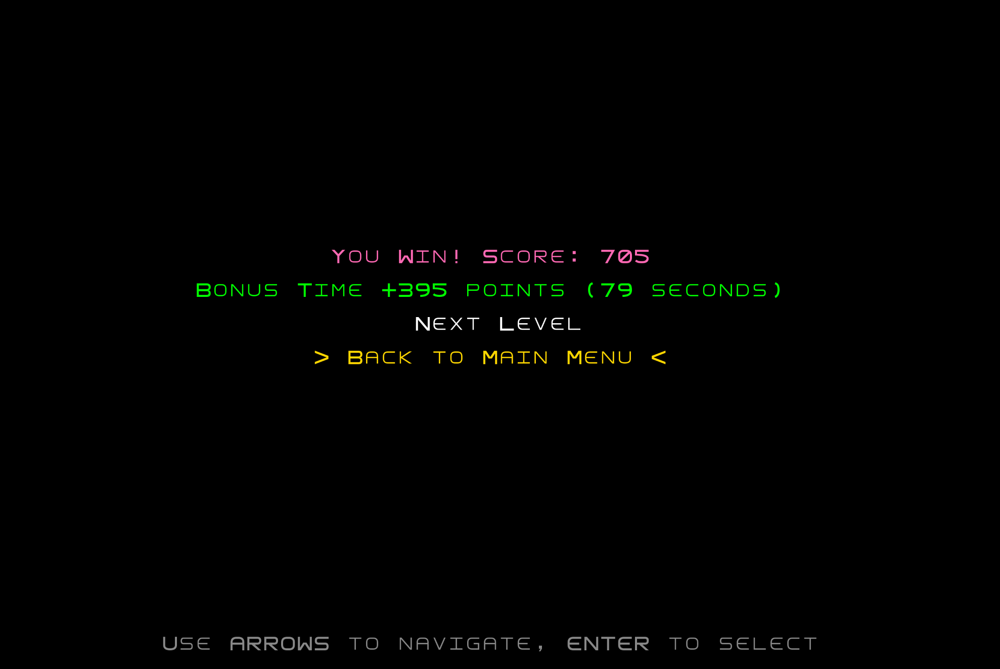

# LDTS_T13_G09 - SweetRush

## Descrição do Jogo

SweetRush é um jogo 2D inspirado no clássico Bad Ice Cream. O objetivo do jogador é evitar os monstros enquanto recolhe todos os doces espalhados pelo mapa.

O jogo apresenta múltiplos níveis, destacando-se pela possibilidade de criar e destruir paredes em linha reta, o que proporciona uma dinâmica diferente.

Este projeto foi desenvolvido por Leandro Moreira (up202405528@up.pt) para LDTS 2025-26.

Um relatório mais detalhado pode ser visto [aqui](./docs/README.md).

### Pré-visualização do Jogo

  

  <b><i>Gif 1. Jogabilidade: Monstros e Paredes</i></b>
   
  <a href="docs/images/gifs/gameplay_demo.gif">docs/images/gifs/gameplay_demo.gif</a>

  Esta pré-visualização mostra o jogador a navegar no nível 1, a ser perseguido por monstros e a utilizar a mecânica de criar paredes para se defender. Além disso, mostra o jogador a completar uma onda de doces e o aparecimento da próxima.

 

  

  <b><i>Gif 2. Modo Multijogador</i></b>
   
  <a href="docs/images/gifs/multiplayer_demo.gif">docs/images/gifs/multiplayer_demo.gif</a>

  Demonstração do modo de 2 jogadores

 
 

### Interface de Jogo

  

  <b><i>Fig 1. Informações de Jogo</i></b>
   
  <a href="docs/images/screenshots/game_hud.png">docs/images/screenshots/game_hud.png</a>

  A interface exibe informações cruciais como a pontuação atual, a onda em que o jogador se encontra e a quantidade de doces restantes para completar a onda.

 

  

  <b><i>Fig 2. Temporizador</i></b>
   
  <a href="docs/images/screenshots/timer_hud.png">docs/images/screenshots/timer_hud.png</a>

  O jogo inclui um temporizador que desafia o jogador a completar o nível dentro de um limite de tempo específico.

 
 

### Menus

  

  <b><i>Fig 3. Menu Principal</i></b>
   
  <a href="docs/images/screenshots/main_menu.png">docs/images/screenshots/main_menu.png</a>

  O Menu Principal permite iniciar o jogo, consultar pontuações, aceder à ajuda ou sair da aplicação.

 
 

  

  <b><i>Fig 4. Menu de Seleção de Jogador</i></b>
   
  <a href="docs/images/screenshots/player_selection_menu.png">docs/images/screenshots/player_selection_menu.png</a>

  O Menu de Seleção de Jogador permite ao utilizador escolher o número de jogadores que participam na sessão de jogo.

 
 

  

  <b><i>Gif 3. Menu de Ajuda</i></b>
   
  <a href="docs/images/gifs/help_menu.gif">docs/images/gifs/help_menu.gif</a>

  O Menu de Ajuda fornece instruções sobre como jogar e os controlos do jogo.

 
 

### Fim de Jogo

  

  <b><i>Fig 5. Menu de Vitória</i></b>
   
  <a href="docs/images/screenshots/win_menu.png">docs/images/screenshots/win_menu.png</a>

  O Ecrã de Vitória aparece quando o jogador recolhe com sucesso todos os doces sem ser apanhado, e mostra a pontuação final.

 
 
