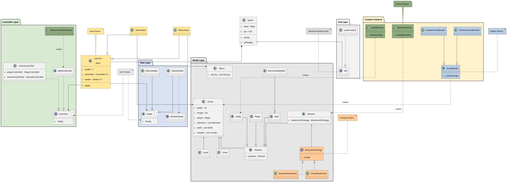
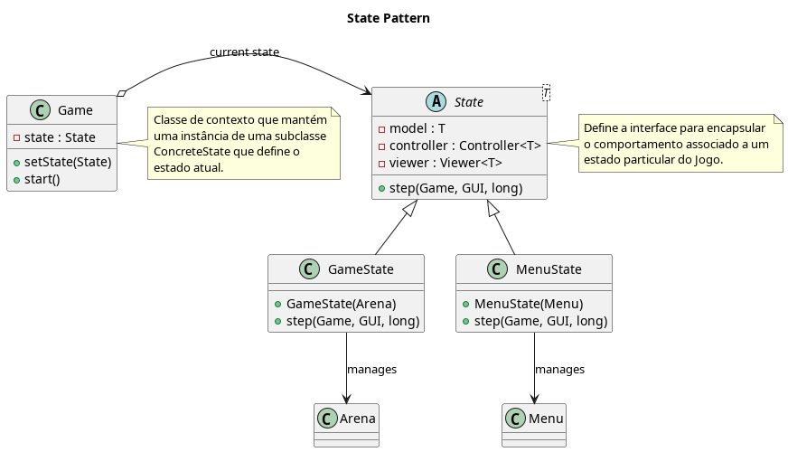
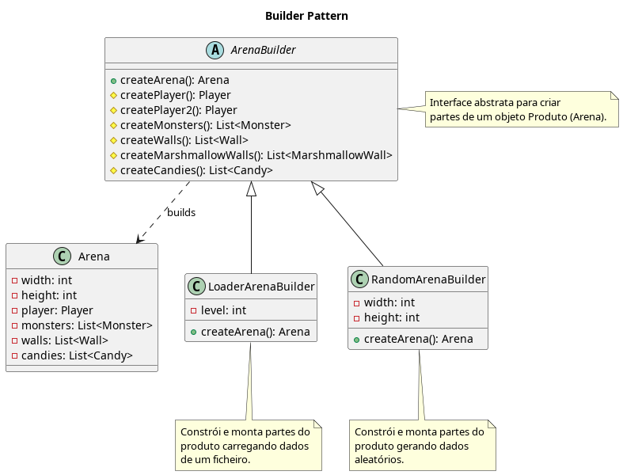
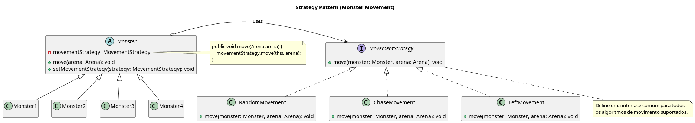
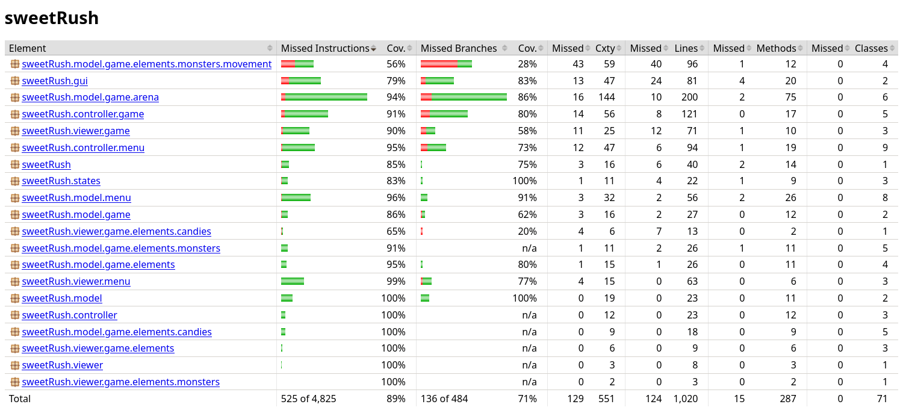
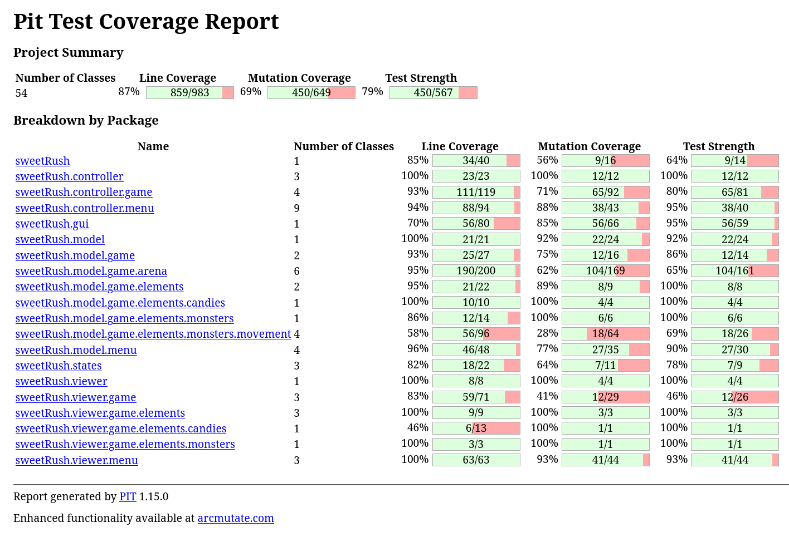

# T13G09 - SweetRush

---

# Índice

- [O que é o SweetRush?](#o-que-é-o-sweetrush)
  - [Como Funciona o Jogo?](#como-funciona-o-jogo)
  - [Controlos](#controls)
- [Funcionalidades Implementadas](#funcionalidades-implementadas)
- [Funcionalidades para o Futuro](#funcionalidades-para-o-futuro)
- [Arquitetura Geral](#arquitetura-geral)
- [Design Patterns Implementados](#design-patterns)
  - [1. Model-View-Controller (MVC) - Architectural Pattern](#1-model-view-controller-mvc---architectural-pattern)
  - [2. State Pattern](#2-state-pattern)
  - [3. Factory Method Pattern](#3-factory-method-pattern)
  - [4. Builder Pattern](#4-builder-pattern)
  - [5. Game Loop Pattern](#5-game-loop-pattern)
  - [6. Strategy Pattern](#6-strategy-pattern)
- [SOLID Principles](#solid-principles)
- [Code Smells conhecidos](#code-smells)
- [Testes](#testing)
- [Autoavaliação](#autoavaliacao)

---

Este projeto foi desenvolvido por Leandro Moreira (up202405528@up.pt)

---

## O que é o SweetRush?
**SweetRush** é um jogo 2D inspirado no clássico Bad Ice Cream, disponível na plataforma FRIV. O objetivo do jogador é evitar os monstros, cada um com comportamentos e características distintas, enquanto recolhe todos os doces espalhados pelo mapa.

O jogo é composto por múltiplos níveis e cada nível é dividido em várias fases ("waves") de doces, que vão surgindo de forma progressiva. A principal particularidade do SweetRush é a mecânica que permite ao jogador criar e destruir paredes em linha reta, o que distingue este jogo de outros do mesmo género.

---

### Como Funciona o Jogo?
- **Paredes**: O jogador pode construir e destruir paredes para proteger-se dos monstros ou para os bloquear, permitindo criar dinâmicas diferentes em cada nível. As paredes são construídas/destruídas em linha: ao pressionar a barra de espaço, é considerada a direção para a qual o jogador está orientado e até onde essa linha é possível. Existem paredes permanentes que não podem ser destruídas, como as próprias bordas da arena.

- **Monstros**: Os monstros perseguem o jogador pelo mapa, cada um com a sua própria velocidade e comportamento. Alguns têm um movimento aleatório ou predefinido, enquanto outros são programados para seguir o jogador. Ainda existem uns que destroem paredes não permanentes ou deslocam-se sobre elas.

- **Doces**: Existem diferentes tipos de doces que o jogador tem de recolher, cada um com um determinado valor em pontos. Tal como no jogo original, existem várias “waves” de frutas: aparece espalhado pelo mapa um tipo de doce e, só depois de recolher todas desse tipo, surge o seguinte.

---

### Controlos

#### Jogador 1
- `↑` : Move o jogador para cima.
- `↓` : Move o jogador para baixo.
- `←` : Move o jogador para a esquerda.
- `→` : Move o jogador para a direita.
- `ESPAÇO` : Cria ou destrói paredes na direção para a qual o jogador está virado.

#### Jogador 2
- `W` : Move o jogador para cima.
- `S` : Move o jogador para baixo.
- `A` : Move o jogador para a esquerda.
- `D` : Move o jogador para a direita.
- `F` : Cria ou destrói paredes na direção para a qual o jogador está virado.

#### Controlos do Menu
- `ENTER` : Pressione ENTER para selecionar a opção destacada no menu.
- `↑` : Move a seleção para cima no menu.
- `↓` : Move a seleção para baixo no menu.
- `P` : Pausa o jogo.
- `Q` : Sai do jogo.

---

## Funcionalidades Implementadas

- **Movimento do jogador**: O jogador pode mover-se livremente pela arena usando as setas do teclado (CIMA, BAIXO, ESQUERDA, DIREITA). O jogador tem uma direção de facing que determina a orientação para criação de paredes.

- **Criação e destruição de paredes**: O jogador pode criar e destruir paredes em linha reta, na direção em que está virado, pressionando a barra de espaço. Existem paredes permanentes (bordas da arena) e temporárias (marshmallow walls) que podem ser destruídas.

- **Recolha de doces**: O jogador pode recolher doces espalhados pelo mapa, que surgem em várias "waves". Cada tipo de doce deve ser recolhido completamente antes de passar à próxima wave.

- **Monstros com comportamentos distintos**: Existem vários tipos de monstros, cada um com a sua própria velocidade e comportamento, como movimento aleatório, perseguição do jogador ou destruição de paredes.

- **Modo de dois jogadores**: Suporte para dois jogadores simultaneamente, com controlos separados.

- **Sistema de pontuação**: Pontuação acumulada baseada na recolha de doces, com pontos adicionados por cada doce recolhido e pelo tempo que restou ao completar o nível.

- **Temporizador**: Limite de tempo para completar níveis, com contagem regressiva. O jogo termina se o tempo acabar.

- **Menus do jogo**: O jogo possui vários menus, incluindo o menu principal (MainMenu), menu de pausa (PauseMenu), menu de seleção de níveis (LevelsMenu), menu de número de jogadores (NumberOfPlayersMenu), menu de ajuda (HelpMenu), menu de vitória (WinMenu) e menu de game over (GameOverMenu).

- **Carregamento de níveis**: Os níveis são carregados a partir de ficheiros .lvl, que contêm todas as informações necessárias para criar um nível (ex.: tempo)
---

## Funcionalidades para o Futuro

- **Sistema de pontuação**:
    - Quadro de pontuações.
    - Guardar as pontuações entre sessões.

- **Vidas do Jogador**
    - Ao entrar em contacto com qualquer monstro, o jogador perde uma vida em vez de dar gameover instantaneamente;

- **Power-Ups** (temporários):
    - Aumento de velocidade;
    - Invencibilidade;
    - Congelar os monstros;
    - Capacidade de andar sobre as paredes.

- **Monstros Diferentes**:
    - Monstros que destroem paredes numa área de 3x3;
    - Monstros que saltam por cima de paredes de um único bloco;
    - Entre outras ideias.

- **Doces que se movem**:
    - Doces que fogem do jogador;
    - Doces que se teletransportam.

- **Visual Effects**:
    - Melhor representação gráfica do jogo.

- **Sound Effects**

---

## Arquitetura Geral

Abaixo apresenta-se o diagrama UML que ilustra a visão geral da arquitetura do projeto, destacando os principais componentes e padrões de design utilizados.

  

  <b><i>Fig 0. Diagrama da Arquitetura Geral</i></b>
   
  <a href="images/uml/architecture_overview.png">images/uml/architecture_overview.png</a>

---

## Design Patterns Implementados

### 1. **Model-View-Controller (MVC)** - Architectural Pattern
**Objetivo**: Resolver o problema de misturar lógica de jogo, apresentação e tratamento de input, separando-os em camadas distintas (Model, View, Controller).

**Implementação**:
- **Model**: `src/main/java/sweetRush/model/`
- **View**: `src/main/java/sweetRush/viewer/`
- **Controller**: `src/main/java/sweetRush/controller/`

**Vantagens**:
- Permite testar a lógica do modelo (como movimento de jogadores e monstros) independentemente da renderização gráfica.
- Garante uma separação clara de responsabilidades, facilitando a manutenção e extensão do código (ex.: adicionar novos viewers sem alterar o model).

Diagrama de representação do padrão MVC:

   
 

 

   <b><i>Fig 1. Diagrama do padrão MVC</i></b>
    
   <a href="images/uml/mvc_pattern.png">images/uml/mvc_pattern.png</a>
 

---

### 2. **State Pattern**
**Objetivo**: Resolver o problema de gerir múltiplos estados do jogo com lógica condicional complexa, encapsulando cada estado em uma classe separada.

**Implementação**:
- Classe abstrata `State<T>` com o método `step()`;
- Classes: `GameState`, `MenuState`;
- `src/main/java/sweetRush/states/`

**Vantagens**:
- Torna mais fácil adicionar novos estados (como `PauseState` ou `GameOverState`) sem ter de mexer no código existente.
- Ajuda a evitar bugs nas mudanças de estado, porque as transições são claras e explícitas.
- O código fica mais organizado, já que cada estado trata do seu próprio comportamento e é mais fácil de perceber.

Diagrama de representação do padrão State:

   
 

 

   <b><i>Fig 2. Diagrama do padrão State</i></b>
    
   <a href="images/uml/state_pattern.png">images/uml/state_pattern.png</a>
 

---

### 3. **Factory Method Pattern**
**Objetivo**: Resolver o problema da criação direta de objetos, centralizando e abstraindo a criação de monstros e doces.

**Implementação**:
- `MonsterFactory.createMonster(char type, int x, int y)`
- `CandyFactory.createCandy(char type, int x, int y)`

**Vantagens**:
- Torna mais fácil adicionar novos monstros ou doces sem ter de mexer no resto do código (basta alterar a factory).
- Como a lógica de criação está toda num sítio só, evita-se repetir código e fica tudo mais organizado.

Diagrama de representação do padrão Factory Method:

   
 

 

   <b><i>Fig 3. Diagrama do padrão Factory Method</i></b>
    
   <a href="images/uml/factory_method_pattern.png">images/uml/factory_method_pattern.png</a>
 

---

### 4. **Builder Pattern**
**Objetivo**: Resolver o problema de construir objetos complexos como `Arena` de forma flexível, permitindo variar a origem dos dados (ficheiros ou geração aleatória) sem alterar a estrutura da arena.

**Implementação**:
- `ArenaBuilder` classe abstrata com o método `createArena()`
- `LoaderArenaBuilder`: Constrói a arena a partir de ficheiros `.lvl`
- `RandomArenaBuilder`: Gera arenas aleatórias (para testes)
- `src/main/java/sweetRush/model/game/arena/ArenaBuilder.java`

**Vantagens**:
- Permite construir objetos complexos passo a passo.
- Separa a construção da representação, facilitando a adição de novos tipos de construção.
- Permite criar diferentes representações do mesmo objeto.

Diagrama de representação do padrão Builder:

   
 

 

   <b><i>Fig 4. Diagrama do padrão Builder</i></b>
    
   <a href="images/uml/builder_pattern.png">images/uml/builder_pattern.png</a>
 

---

### 5. **Game Loop Pattern**
**Objetivo**: Resolver o problema de sincronização e taxa de frames inconsistente, mantendo um loop principal fixo.

**Implementação**:
- Loop Principal no método `Game.start()`
- FPS fixos (20 frames per second)
- `src/main/java/sweetRush/Game.java`

**Vantagens**:
- Garante que o jogo progride de forma fluida e determinística.
- Facilita a sincronização entre o estado do jogo, o input do utilizador e a renderização no ecrã.

Diagrama de representação do padrão Game Loop:

   
 

 

   <b><i>Fig 5. Diagrama do padrão Game Loop</i></b>
    
   <a href="images/uml/game_loop_pattern.png">images/uml/game_loop_pattern.png</a>
 

---

### 6. **Strategy Pattern**
**Objetivo**: Resolver o problema de hardcode de algoritmos de movimento, permitindo mudar estratégias dinamicamente.

**Implementação**:
- Interface `MovementStrategy` para diferentes comportamentos dos monstros.
- Classes concretas como `RandomMovement`, `ChaseMovement` que implementam `MovementStrategy`.
- `src/main/java/sweetRush/model/game/elements/monsters/movement/`

**Vantagens**:
- Facilita a implementação de novos comportamentos de movimento como `LeftMovement` sem alterar a classe `Monster`.
- Separa a lógica de movimento do comportamento específico de cada monstro.

Diagrama de representação do padrão Strategy:

   
 

 

   <b><i>Fig 6. Diagrama do padrão Strategy</i></b>
    
   <a href="images/uml/strategy_pattern.png">images/uml/strategy_pattern.png</a>
 

---

## SOLID Principles

- **Single Responsibility Principle (SRP)**: Cada classe deve ter uma única responsabilidade. Por exemplo, a classe `Player` gere apenas o jogador, enquanto `Arena` gere a arena.

- **Open/Closed Principle (OCP)**: As classes devem estar abertas para extensão, mas fechadas para modificação. Novos tipos de monstros podem ser adicionados sem alterar o código existente.

- **Liskov Substitution Principle (LSP)**: Subclasses devem ser substituíveis por suas superclasses. Qualquer `MovementStrategy` pode ser usada sem quebrar o comportamento.

- **Interface Segregation Principle (ISP)**: Interfaces devem ser específicas e não forçar implementações desnecessárias. `MovementStrategy` é focada apenas no movimento.

- **Dependency Inversion Principle (DIP)**: Depender de abstrações, não de concretizações. O `ArenaBuilder` usa interfaces para criar arenas.

---

## Code Smells conhecidos

- **Leaking Encapsulation**: A classe `Arena` acaba por expor a sua estrutura interna, já que os getters devolvem as listas de monstros e paredes diretamente. Isto pode ser um problema porque permite alterações externas. O ideal será retornar cópias imutáveis ou iteradores.
- **Refused Bequest / Type Code**: A hierarquia dos doces (`Red`, `Blue`, etc.) parece um pouco complexa dado que todos fazem o mesmo. Acaba por ser apenas uma forma de definir o "tipo", o que podia ser feito com um Enum. Ainda assim, deixei ficar esta estrutura a pensar em funcionalidades futuras onde cada doce possa ter o seu próprio comportamento.
- **Primitive Obsession**: No controlo do progresso do jogo (`Game`), usei variáveis simples como `currentLevel` e `currentWave`. Teria sido mais correto encapsular esta gestão de estado numa classe dedicada, como `LevelManager`, para evitar ter lógica espalhada.
- **Data Class**: A classe `Arena` é demasiado passiva, agindo quase só como um contentor de dados para os Controllers manipularem. Devia ter incluído mais métodos de lógica na própria Arena (como verificar colisões ou ocupação) para evitar este "code smell".

---

## Testes

### Testes de Cobertura

  

  <b><i>Fig 7. Screenshot do relatório de cobertura</i></b>
   
  <a href="images/screenshots/coverage_report.png">images/screenshots/coverage_report.png</a>

[Relatório de cobertura](../build/reports/jacoco/test/html/index.html)

### Testes de Mutação

  

  <b><i>Fig 8. Screenshot dos testes de mutação</i></b>
   
  <a href="images/screenshots/mutation_report.png">images/screenshots/mutation_report.png</a>

[Testes de mutação](../build/reports/pitest/index.html)

---

## Autoavaliação
O trabalho foi feito individualmente e os restantes elementos do grupo não contribuíram significativamente. A situação foi reportada ao professor responsável.
